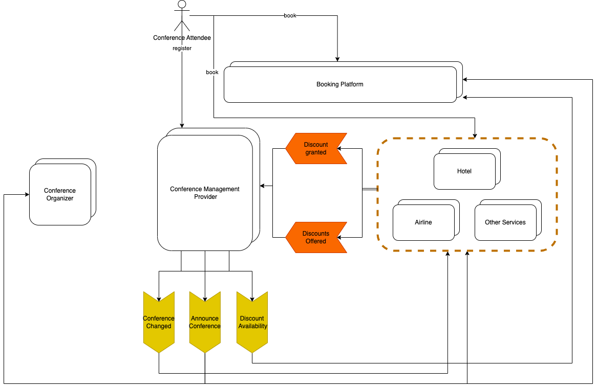

# Disclaimer

Although the scenario is inspired by real-world events, the scenario is 
fictional. It was created for demonstration purposes only, without any 
knowledge of the actual conference organization.

# Scenario: Travel to KubeCon + CloudNativeCon

This demo scenario is motivated by the booking experience of a user who wants to
travel to KubeCon + CloudNativeCon. The user wants to book a flight, hotel, and
conference ticket. Hotels, airlines, and other travel services often offer 
discounts for conference participants. 

## Systems and Involved Parties

### Conference Organizer

The *Conference Organizer* initiates and manages the conference. It is usually 
not a single person but an organization like a foundation or a company. 
Often, the organizer organizes multiple conferences, e.g. for different 
topics or regions.

### Conference Management Service (CMS)

The*Conference Management Service* is a service provider that offers a 
platform for conference organizers to manage their conferences. The focus of 
this scenario is on supporting attendees in booking their travel to the 
conferences, but conference management services may offer a wide range of 
services.
For this scenario, it is important that there are several conference 
management services the conference organizers can choose from. 

### Booking Platform (BP)

Booking platforms offer a wide range of travel services supporting 
travellers in booking their trips. 

### Travel Service Providers (TSPs)

Travel service providers offer services like flights, hotels, or train rides.
When learn about a conference, they decide if they want to offer discounts 
to participants of a conference. 

## Event Flow

### Conference Management Service
    
#### `ConferencePlanned`

The `ConferencePlanned` event is emitted by the CMS when a new conference is 
planned. The event contains information about the conference, like the 
address of the venue, the date, and the maximum number of attendees.

#### `ConferenceUpdated`

The `ConferenceUpdated` event is emitted by the CMS when the conference 
information is updated. This can include changes to all the information made 
available through the `ConferencePlanned` event.

#### `ConferenceCancelled`

The `ConferenceCancelled` event is emitted by the CMS when a conference is 
cancelled. 
   
### Service providers

#### `DiscountOffered`

The `DiscountOffered` event is emitted by a service provider when they 
offer a discount for a conference. The event contains information about 
the conference and the absolute number of discounts offered.

#### `DiscountGranted`

The `DiscountGranted` event is emitted by a service provider when they 
granted discounts to bookers. It contains the information how many discounts 
with a certain `discoundId` have been granted.

## Entitlement of Users to Discounts

The mechanism of communicating the entitlement of users to discounts to 
service providers is out of scope of this scenario description. One option 
would be that users booking a conference ticket can navigate to service 
providers using links generated by the conference management service.
Another option could be that booking platforms and service providers could 
verify the user's entitlement by calling the conference management 
provider's API to retrieve an OAuth token as a proof of eligibility.  
